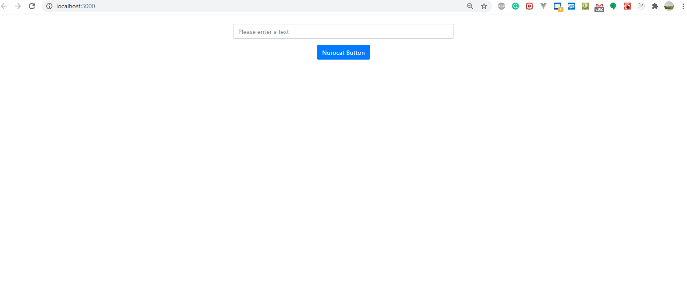

## Available Scripts

In the project directory, First install node_modules
by:
### `yarn install`

Then you can run:

### `yarn start`

Run the test by

### `yarn test`

Launches the test runner in the interactive watch mode. 
See the section about [running tests](https://facebook.github.io/create-react-app/docs/running-tests) for more information.

This project was bootstrapped with [Create React App](https://github.com/facebook/create-react-app).

---
Please see the `screenshot` to see the view

